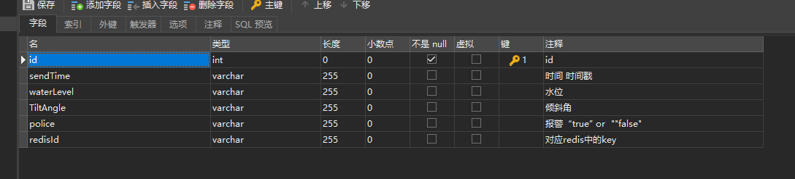
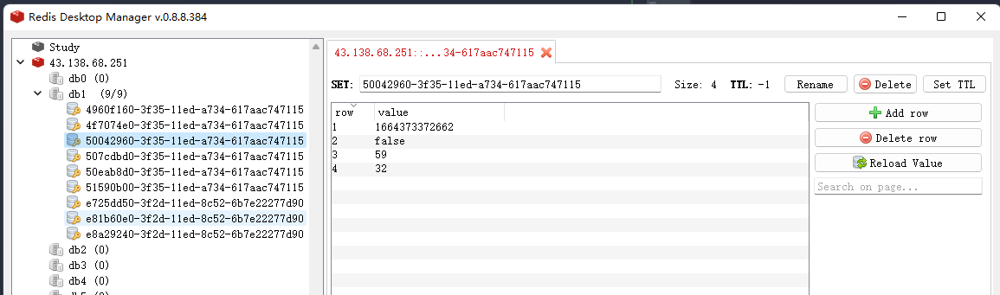

# 泥石流项目

## 规范
* 状态码：0->失败 ；1->成功
* ✅->已完成 ；❌->待完成
## 2022-9-26-13:40

<ol>
<li>增加Mock后台 模拟硬件数据 每一分钟向mysql添加一条mock数据</li>
</ol>

> 目录->/mock
>
> App ip -> 43.138.68.251
>
> App prot ->3000
>
> Mock prot -> 4399 
>
> mysql port -> 33066
>
> mysql字段：
>
> 
>
> redis port -> 6379 db:1
>
> redis key 为随机生成的唯一id
>
> 
>

## 2022-9-27-15:40

<ol>
<li>加入前端Vue2 ，element ui完整引入，配置路由</li>
<li>增加 log4js </li>
</ol>

>PS :
>* 后端三层架构：
>* dao：持久层 ->负责数据库查询增删改查操作
>* service：业务层 -> 负责dao层上来的数据进行进一步处理
>* routes：表现层 // 也有叫做controller层 -> 负责前端与后端交互的入口 控制路由 负责service层上来的数据
>* 分层 分包思想 模块化——————

## 2022-9-28-16:40

* fix linux 时差 为东八区
* change mysql 的 sendTime字段数据类别为 timestamp
* add mysql字段redisId 与 redis 关联 redis-> ioredis
* change nodeVersion => 16.14.0 解决无法import引入部分模块 提高兼容性
* 增加接口
  * get
    * ip/api/getAllData -> 获取所有数据 ✅
  * post
    * ip/api/getDataByTime -> 根据时间段获取数据  ✅
      * parameter-->startTime:string||number,endTime:string||number;
      * return-->时间段数据 
      * ps:时间格式->时间戳
    * ip/api/getDataById -> 根据Id获取数据  ✅
      * parameter-->Id:number;
      * return-->单条数据
    * ip/api/getDataByWaterLevel -> 根据waterLevel获取数据  ✅
      * parameter-->StartWaterLevel:string||number,EndWaterLevel:string||number;
      * return-->满足waterLever范围的数据
    * ip/api/getDataByTiltAngle -> 根据TiltAngle获取数据  ✅
      * parameter-->StartTiltAngle:string||number,EndTiltAngle:string||number;
      * return-->满足TiltAngle范围的数据
    * ip/api/getDataByPolice -> 根据Police获取数据  ✅
      * parameter-->police:true||false;
      * return-->满足police的数据
    * ip/api/addData -> 存入数据 ✅
      * parameter-->waterLevel:string TiltAngle:string police:string 
    * ip/api/delDataById -> 根据Id删除数据 ✅
      * parameter-->Id:number 
